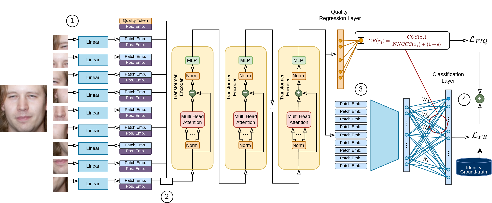

<div align="center"> Official repository of </div>

# <div align="center"> ViT-FIQA: Assessing Face Image Quality using Vision Transformers </div>

<div align="center", padding="30px">
  <span style="display:block; height: 20em;">&emsp;</span>
  <p><b>Andrea Atzori</b><sup> 1</sup> &emsp; <b>Fadi Boutros</b><sup> 1</sup>; <b>Naser Damer</b><sup> 1,2</sup> &emsp</p>
  <p><sup>1 </sup>Fraunhofer IGD &emsp; <sup>2 </sup>Technische Universität Darmstadt</p>
  <p>Accepted at ICCV Workshops 2025</p>
</div>

<div align="center">
        <a href="https://www.arxiv.org/pdf/2508.13957"></a>
        &emsp;
        <a href="https://drive.google.com/drive/u/0/folders/1CZVZnZbnoNaxk_xHhIHU5yLRi7Iqa1jP"></a>
</div>


## <div align="center"> Overview 🔎 </div>
<div align="center">
    
</div>

An overview of the proposed ViT-FIQA for assessing the quality of face samples.
A face sample is divided in equally sized, non-overlapping patches of size $P \times P$. All these patches are then flattened and linearly projected to extract the embeddings. 2) A learnable quality token is concatenated to the patch tokens. The concatenated tokens are fed as input to a sequence of Transformer Encoder layers. 3) The final sequence of embeddings is then used as follows: the first one - the refined quality token - is used as input to the regression layer in order to predict the utility value of the sample, while the remaining patches are used as input for a fully connected layer to obtain a final embedding representing the sample. 4) The two loss terms ($L_{FR}$ and $L_{FIQ}$) are computed and added to obtain the final loss value.


## <div align="center"> Abstract 🤏 </div>

Face Image Quality Assessment (FIQA) aims to predict the utility of a face image for face recognition (FR) systems. State-of-the-art FIQA methods mainly rely on convolutional neural networks (CNNs), leaving the potential of Vision Transformer (ViT) architectures underexplored. This work proposes ViT-FIQA, a novel approach that extends standard ViT backbones, originally optimized for FR, through a learnable quality token designed to predict a scalar utility score for any given face image. The learnable quality token is concatenated with the standard image patch tokens, and the whole sequence is processed via global self-attention by the ViT encoders to aggregate contextual information across all patches. At the output of the backbone, ViT-FIQA branches into two heads: (1) the patch tokens are passed through a fully connected layer to learn discriminative face representations via a margin-penalty softmax loss, and (2) the quality token is fed into a regression head to learn to predict the face sample's utility. Extensive experiments on challenging benchmarks and several FR models, including both CNN- and ViT-based architectures, demonstrate that ViT-FIQA consistently achieves top-tier performance. These results underscore the effectiveness of transformer-based architectures in modeling face image utility and highlight the potential of ViTs as a scalable foundation for future FIQA research.
## <div align="center"> Usage 🖥 </div>

### Setup

Install all necessary packages in a Python >=3.10 environment:
```
   pip install torch torchvision numpy opencv-python mxnet easydict scipy==1.8.1 numpy==1.23.1
```

### Extract Face Image Quality Scores

To extract scores for images in a folder,
1. download pre-trained model weights [from this link](https://drive.google.com/drive/u/0/folders/1CZVZnZbnoNaxk_xHhIHU5yLRi7Iqa1jP) and place them in a location of your choice
2. run `python evaluation/getQualityScore.py` and set arguments accordingly
    ```
    usage: getQualityScore.py   [--data-dir DATA_DIR] 
                                [--pairs PAIRS] 
                                [--datasets DATASETS] 
                                [--gpu_id GPU_ID] 
                                [--model_path MODEL_PATH] 
                                [--backbone BACKBONE] 
                                [--score_file_name SCORE_FILE_NAME] 
                                [--color_channel COLOR_CHANNEL]
    GraFIQs

    options:
    --data-dir DATA_DIR   Root dir for evaluation dataset
    --pairs PAIRS         lfw pairs.
    --datasets DATASETS   list of evaluation datasets (,) e.g. XQLFW, lfw,calfw,agedb_30,cfp_fp,cplfw,IJBC.
    --gpu_id GPU_ID       GPU id.
    --model_path MODEL_PATH
                        path to pretrained evaluation.
    --backbone BACKBONE   vit_FC or iresnet100 or iresnet50
    --score_file_name SCORE_FILE_NAME
                        score file name, the file will be store in the same data dir
    --color_channel COLOR_CHANNEL
                        input image color channel, two option RGB or BGR
    ```

### Evaluation and EDC curves

Please refer to [CR-FIQA repository](https://github.com/fdbtrs/CR-FIQA/tree/main) for evaluation and EDC plotting.

## <div align="center"> Citation ✒ </div>

If you found this work helpful for your research, please cite the article with the following bibtex entry:
```
@misc{atzori2025vitfiqaassessingfaceimage,
      title={ViT-FIQA: Assessing Face Image Quality using Vision Transformers}, 
      author={Andrea Atzori and Fadi Boutros and Naser Damer},
      year={2025},
      eprint={2508.13957},
      archivePrefix={arXiv},
      primaryClass={cs.CV},
      url={https://arxiv.org/abs/2508.13957}, 
}
```

## License ##

This project is licensed under the terms of the Attribution-NonCommercial 4.0 International (CC BY-NC 4.0) license.

Copyright (c) 2025 Fraunhofer Institute for Computer Graphics Research IGD, Darmstadt.